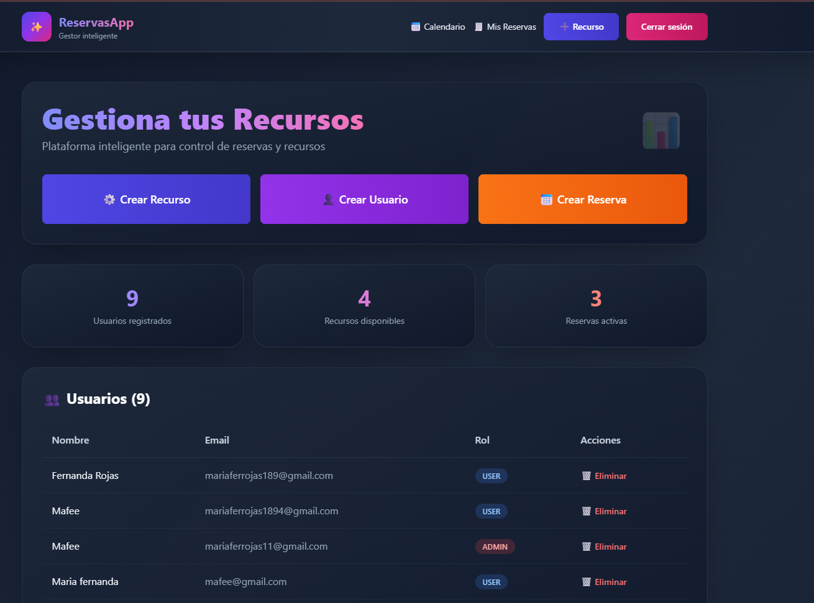
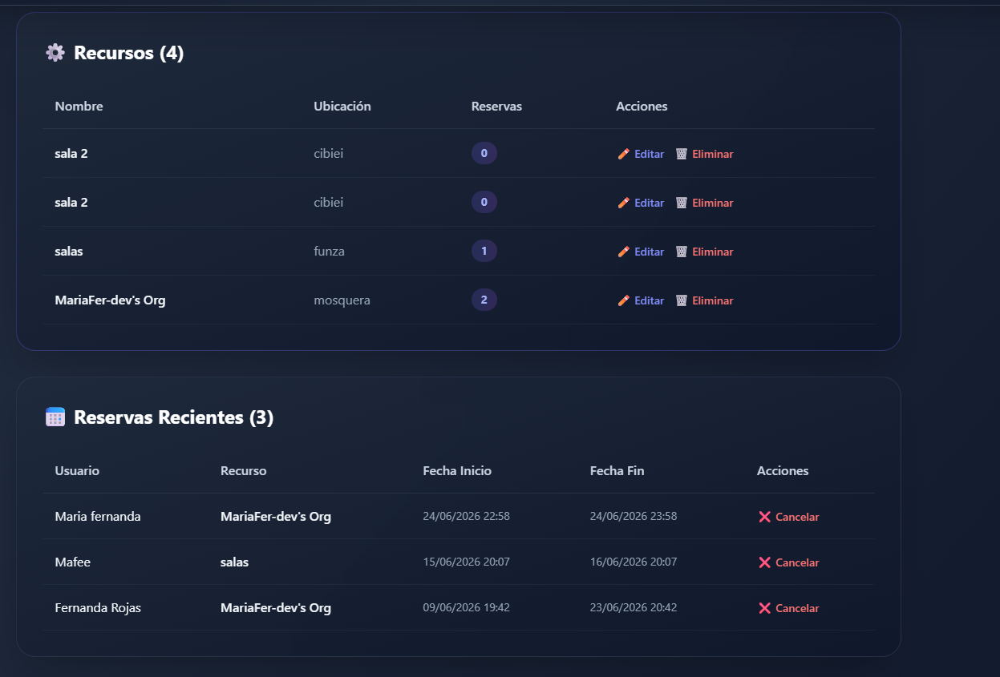
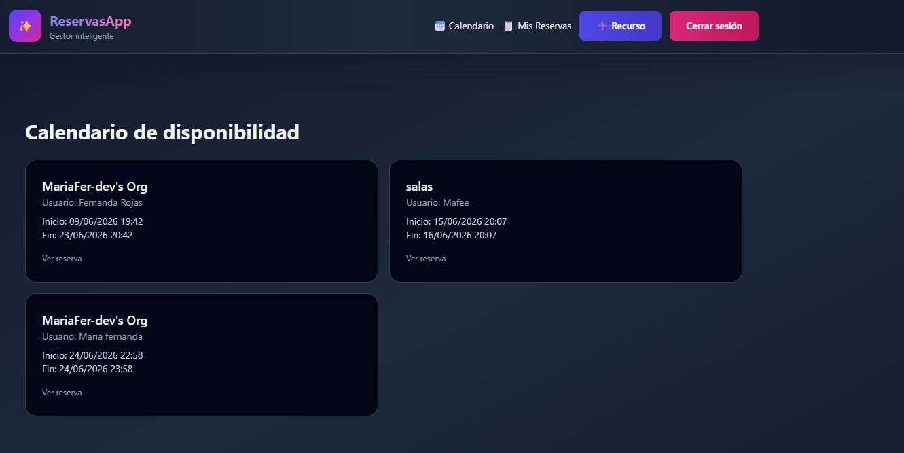
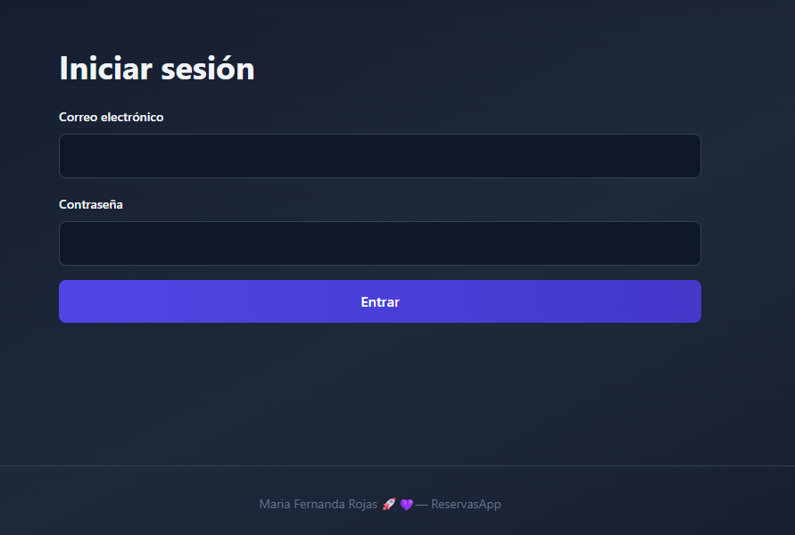
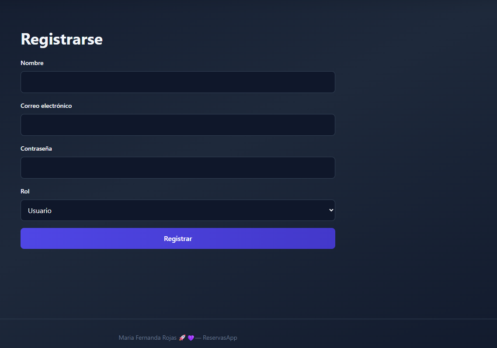

# Reserva de espacios 📝

Aplicación web CRUD para gestionar recursos y reservas, creada con Next.js, Prisma y PostgreSQL (Neon).

## Objetivo 😎
 Realizar un Proyecto sencillo para aprender desarrollo full-stack con operaciones CRUD, persistencia en base de datos en línea y despliegue en la nube.

## Tecnologías 🛠️
- Next.js
- React
- TypeScript
- Prisma
- PostgreSQL / Neon
- Vercel

## Modelo de datos 🧩
- Usuarios
- Recursos
- Reservas
- Horarios

## Instrucciones de instalación 🎀
1. Clona el repositorio.
2. Copia `.env.example` a `.env`.
3. Configurar `DATABASE_URL` 
4. Instala dependencias:

```bash
npm install
```


6. Ejecuta la app:

```bash
npm run dev
```

7. Abre `http://localhost:3000`.

## Despliegue en Vercel 🌐
1. Crear un repositorio en GitHub y subir el código.
2. Conectar el repositorio en Vercel.
3. Definir la variable de entorno `DATABASE_URL` en Vercel.
4. Desplegar
5. https://reserva-lilac-two.vercel.app/


## Mira mi trabajo desplegado! 🚀💜





